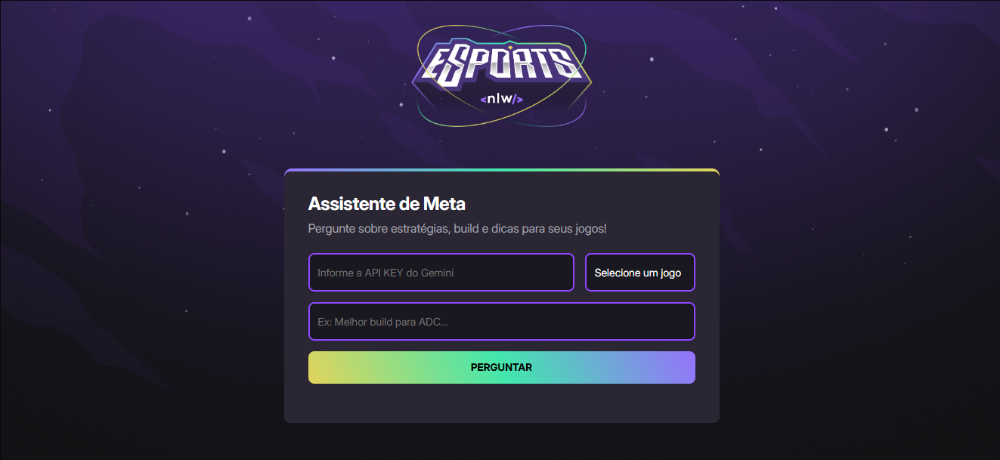

# 🎮 NLW Agents – Assistente Gamer com IA Gemini

O **NLW Esports** é uma aplicação web interativa que utiliza a **IA generativa da Google (Gemini)** para responder perguntas sobre jogos populares como **Valorant**, **League of Legends (LoL)** e **CS:GO**. Através de uma interface simples e direta, os usuários podem consultar estratégias, builds e dicas de forma rápida e inteligente.

---

## 🚀 Funcionalidades

- 🧠 Integração com a IA **Gemini** da Google para respostas contextualizadas.
- 🎮 Seleção de jogos: Valorant, League of Legends e CS:GO.
- ❓ Envio de perguntas personalizadas, como:
  - “Qual a melhor build para ADC no LoL?”
  - “Dicas para subir de patente no CS:GO?”
  - “Melhor agente para jogar split no Valorant?”
- 🔒 Campo seguro para inserir sua **API KEY do Gemini**.
- 💬 Renderização das respostas formatadas (suporte a Markdown).

---

## 🖼️ Interface

A interface foi construída com HTML e CSS puro, utilizando a fonte **Inter** e layout responsivo:

| Tela Inicial                                                                 |
|------------------------------------------------------------------------------|
|    |

---

## 🧠 Como funciona

1. O usuário informa sua **chave da API do Gemini**.
2. Seleciona um jogo no menu suspenso.
3. Digita uma pergunta personalizada.
4. A IA processa a entrada e retorna uma **resposta inteligente** com base no jogo escolhido.

---

## 🛠️ Tecnologias utilizadas

- **Frontend**:  
  - HTML5  
  - CSS3  
  - JavaScript Vanilla  
  - Font: [Inter - Google Fonts](https://fonts.google.com/specimen/Inter)  
- **IA**:  
  - [Gemini API (Google Generative AI)](https://ai.google.dev/)
- **Markdown Rendering**:  
  - [Showdown.js](https://github.com/showdownjs/showdown)

---

## 🧪 Como rodar o projeto localmente

1. Clone este repositório:

```bash
git clone https://github.com/Jorgeigor/NLW-Agents.git
cd nlw-agents
